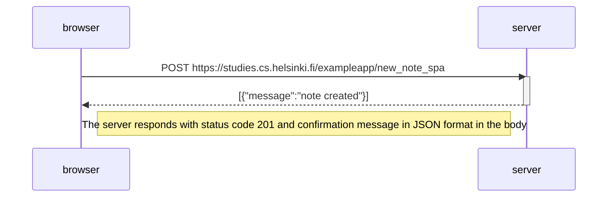

```mermaid
sequenceDiagram
    participant browser
    participant server

    browser->>server: POST https://studies.cs.helsinki.fi/exampleapp/new_note_spa
    activate server
    server-->>browser: [{"message":"note created"}]
    deactivate server

    Note right of browser: The server responds with status code 201 and confirmation message in JSON format in the body
```